# Hangman
Hangman is a Python terminal game which runs on Heroku.

Hangman is a word guessing game. This started out as a paper-and-pencil game that can involve two or more players. One player will think of a word, phrase or sentence and the other player(s) will try to guess the word within a certain number of guesses. Each incorrect guess will cause an element of hangman being drawn. If the players guess the word before the drawing is complete they win, otherwise they lose to the player who set the word.

In this game the user plays against the computer which will generate a random word to be guessed. Instructions are provided in the game to teach the user how to play.

[Link to Hangman game](https://project-3-hangman-game.herokuapp.com/)

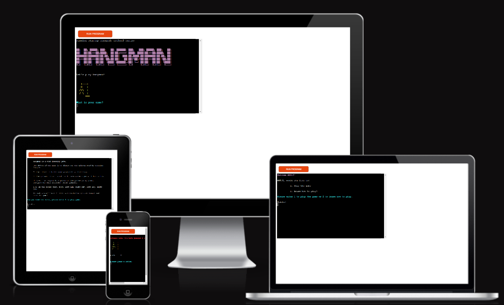

* [How to play](#How-to-play)
* [User Experience (UX)](#User-Experience-(UX))
  * [Initial Discussion](#Initial-Discussion)
  * [User Stories](#User-Stories)

* [Design](#Design)
  * [Colour Scheme](#Colour-Scheme)
  * [Graphics](#Graphics)
  * [Flowchart](#Flowchart)
  
* [Features](#Features)
  * [Future features](#Future-features)

* [Technologies Used](#Technologies-Used)
  * [Languages Used](#Languages-Used)
  * [Frameworks, Libraries & Programs Used](#Frameworks,-Libraries-&-Programs-Used)

* [Testing](#Testing)
  * [Solved Bugs](#Solved-Bugs)
  * [Known Bugs](#Known-Bugs)
  * [PEP8](#PEP8)
  * [Manual Testing](#Manual-Testing)

* [Deployment](#Deployment)
  * [Local Deployment](#Local-Deployment)
  * [Remote Deployment](#Remote-Deployment)
  * [Deploy project to Heroku](#Deploy-project-to-Heroku)
  
* [Credits](#Credits)
  * [Code](#Code)
  * [Content](#Content)
  * [Acknowledgements](#Acknowledgements)

- - -

## How to play

The object of the game is to figure out the unknown word by guessing letters. 

The length of the word is explicitly stated and is marked by underscores for each letter to be guessed. 
If the letter guessed by the user is in the unknown word it will display by replacing the underscores wherever the letter occurs.

If the guessed letter is not in the unknown word the user will lose a try. This will correspond to a person on the gallow being drawn, one part for each incorrect letter guessed. 
i.e. in the order: head, body, left arm, right arm, left leg, right leg.

As such the user will have 6 tries to guess the word before the drawing is complete and they are hanged.
If the user successfully guesses the word before they run out of tries they win the game.

To assist the user, a hint is provided that words to be guessed in this game are animals.

- - -

## User Experience (UX)

### Initial Discussion
In this hangman game the user plays against the computer to guess the word and win the game before they run out of tries and are hanged. 

The target audience is anyone interested in playing a game of hangman. This could be a familiar childhood game for some but there are instructions provided for those who are new to the game.

#### Key information:
* User must enter a name to play
* Instructions on how to play are provided if the user hasn't played before
* Win or lose the user is given an option to play again

### User Stories

#### Client Goals
* To entertain users
* To be able to learn how to play
* To make it easy for users to interact with the game
* To be clearly informed of invalid input and how to proceed
* Win or lose, to play the game to completion without issue
* To be able to choose to play again or quit

#### First Time Visitor Goals
* I want to enter my name.
* I want instructions to be clear and concise.
* I want to be able to learn how to play.
* I want to be informed on what the issue is if an invalid input is made.
* I want to be given instant feedback if a correct or incorrect guess is made.
* I want to be informed when the game is over if I've won or lost.
* I want to be able to play again or quit.

#### Returning Visitor Goals
* I want to be able to play the game multiple times with a new word to guess.

- - -

## Design

### Colour Scheme
The term color module was used to print colored text.

Bright and bold colors were used throughout the game to draw the users attention for a specific purpose or engagement.

Color consistancy is used in the below instances:
* Cyan is used largely when requesting user input.
* Magenta is used largely when the user's chosen name is called alongside text to draw their attention.
* Red is used largely when error messages are raised for invalid input.

### Graphics
* ASCII art was taken from [Texteditor](https://texteditor.com/gallery/)
* Hangman array was taken from [Invent with Python](https://inventwithpython.com/invent4thed/chapter8.html)

### Flowchart
Below is the initial design put together using [Lucid Chart](https://lucid.app/) to plan the logic of the game.

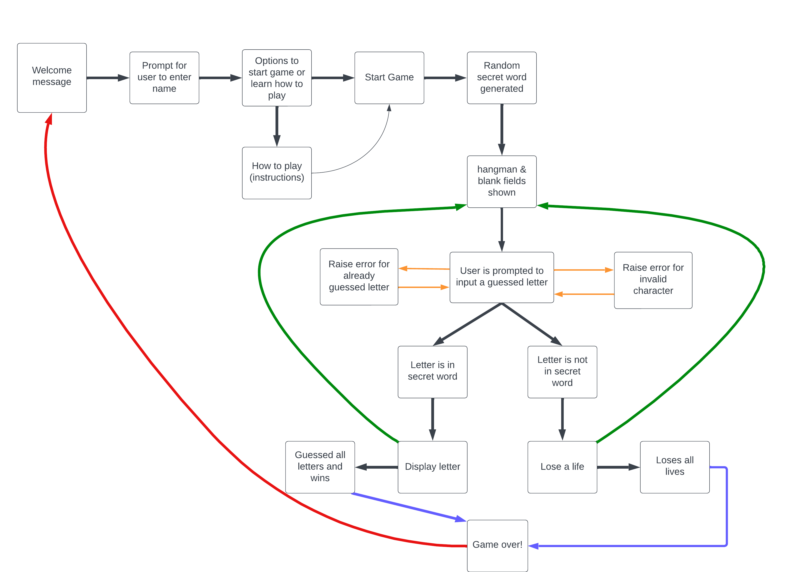

- - -

## Features
Below are the main features the user will come across when playing the game. The terminal is cleared each time to make it clean and prevent confusion if the user starts to scroll. The purposeful use of colors as explained in the design section, is also evidenced below.

1. Hangman game is displayed, with a short message and a request for the user input their name. The name entered by the user is then used by the computer throughout the game to engage with the user.

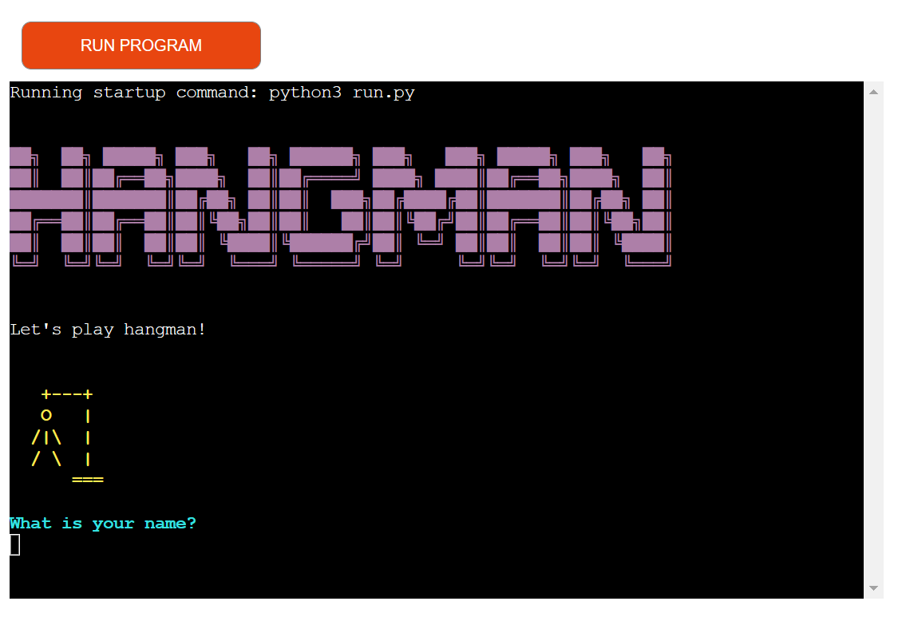

   User input is validated so that a name is only accepted if there are letters. If anything else is entered, the below message in red is displayed to instruct the user.

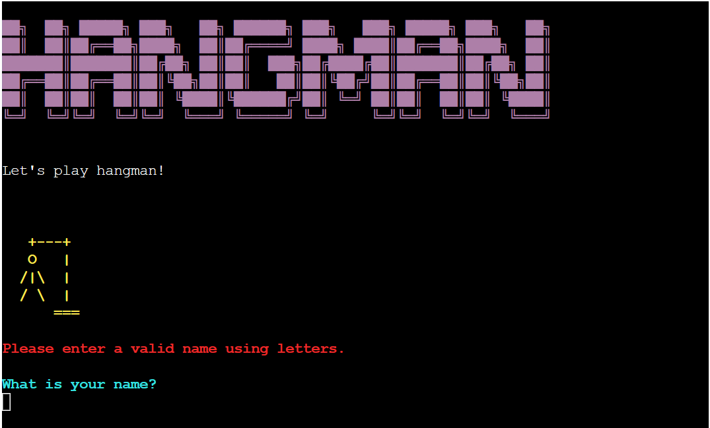

2. The user is called by their name and welcomed to the game. Two menu options are provided, to either play the game or learn how to play. This menu driven interactivity has a clear message requesting input from the user on how they want to proceed.

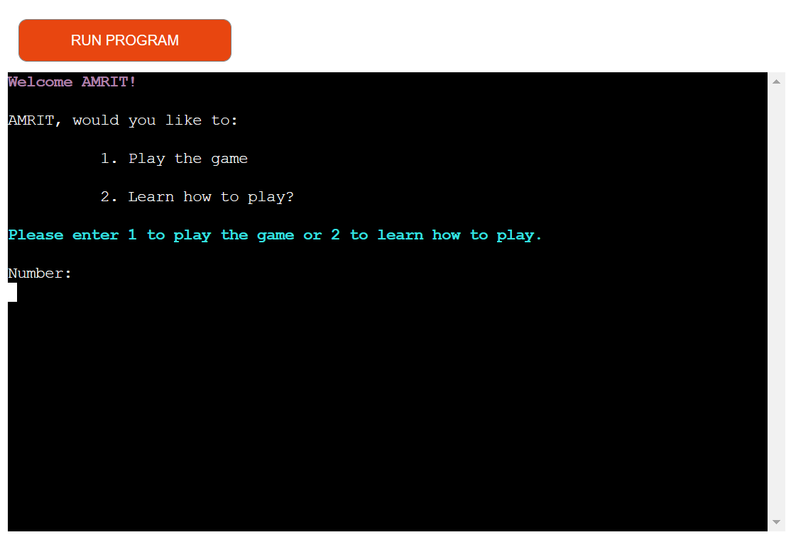

   User input is validated so that either "1" or "2" is accepted. If anything else is entered, the below message in red is displayed to instruct the user.

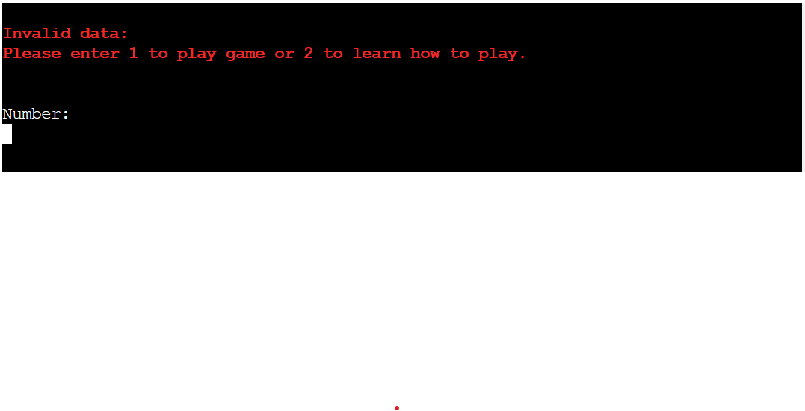

3. If the user chooses to learn how to play, an overview of the game is provided in clear, concise steps. Again a message is then displayed requesting user input in order to play the game.

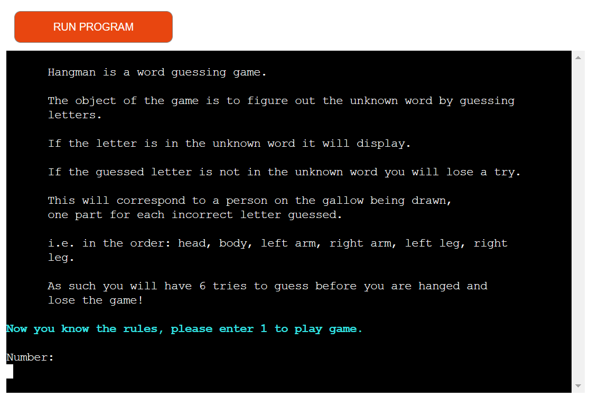

   User input is validated so that only "1" is accepted. If anything else is entered, the below message in red is displayed to instruct the user.

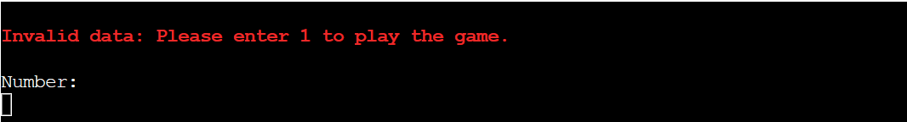

4. Once the user chooses to play the game, the computer will:
* wish the user good luck,
* provide the hint,
* advise on the number or tries they get and
* advise on the the length of the word

The gallow and the word to be guessed (marked by underscores for each letter in the word) is displayed before the message requesting user input to guess a letter. As such there is a clear set up of the game in order for the user to start playing.

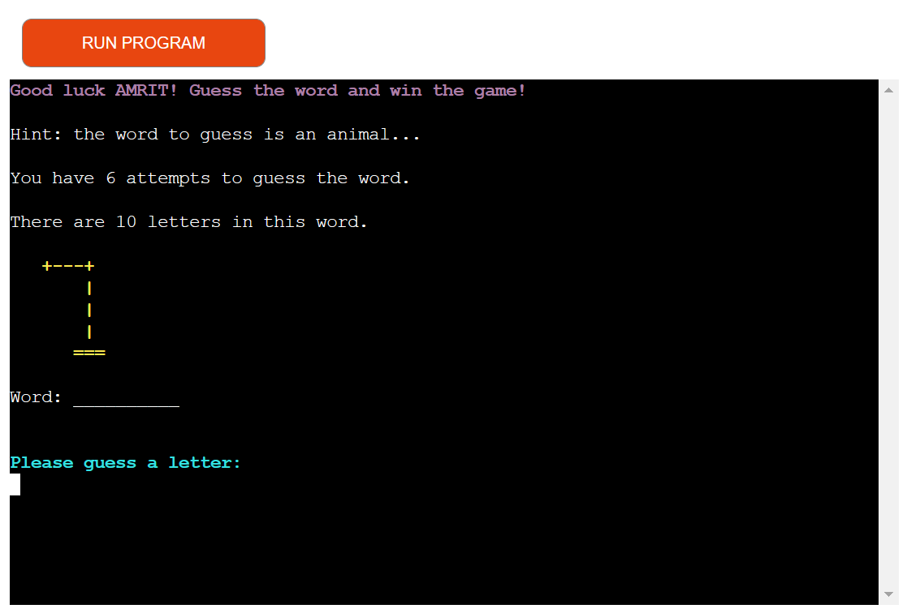

   User input is validated in three ways:
   * if anything other than a letter is entered

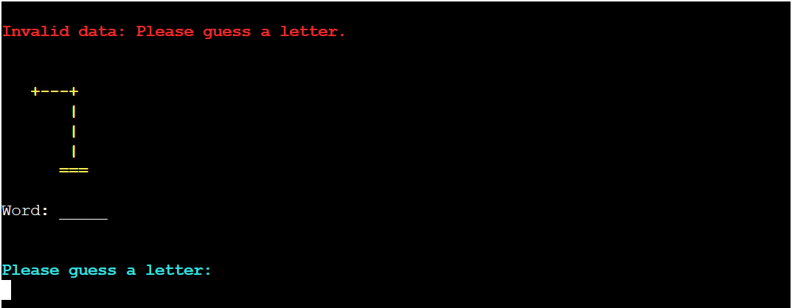

   * if the length of the guess is more than one (as core rule of the game is to guess a letter at a time)

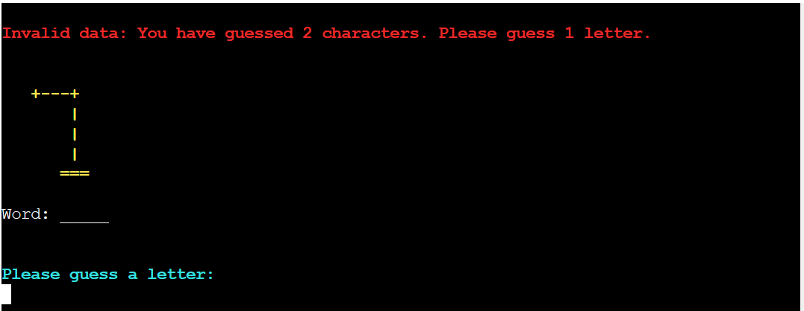
   
   * if letter guessed has already been guessed

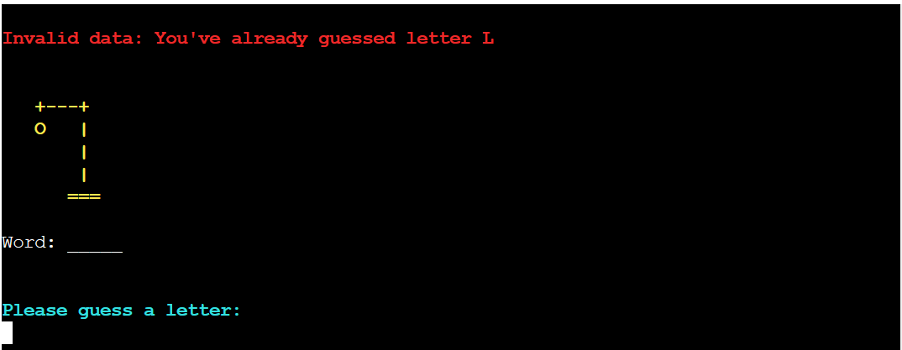

5. If the user guess is correct, clear feedback is provided confirming the letter is in the word. The word to be guessed is updated for that letter wherever it occurs in the word replacing the underscore.

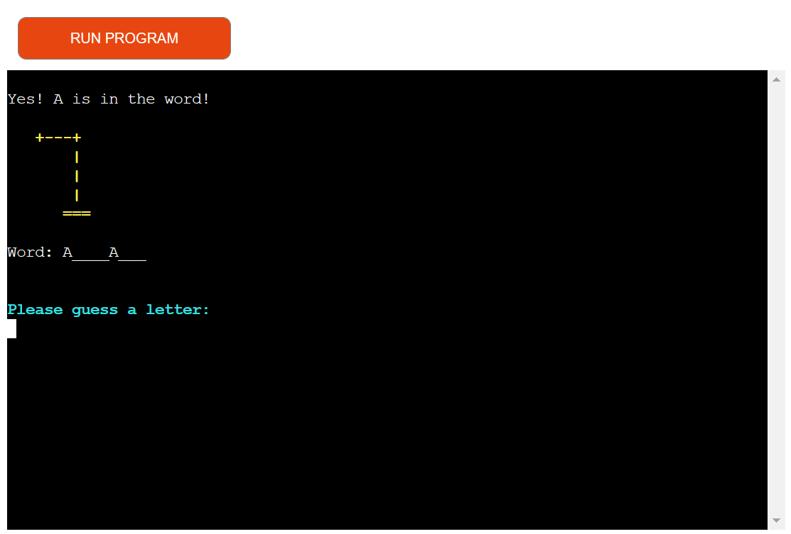

6. If the user guess is incorrect, clear feedback is provided confirming the letter is not in the word. The incorrect guess is added to the "Incorrect guesses: ", the hangman image is updated and the user is updated on the number of attempts they have left to guess the word.

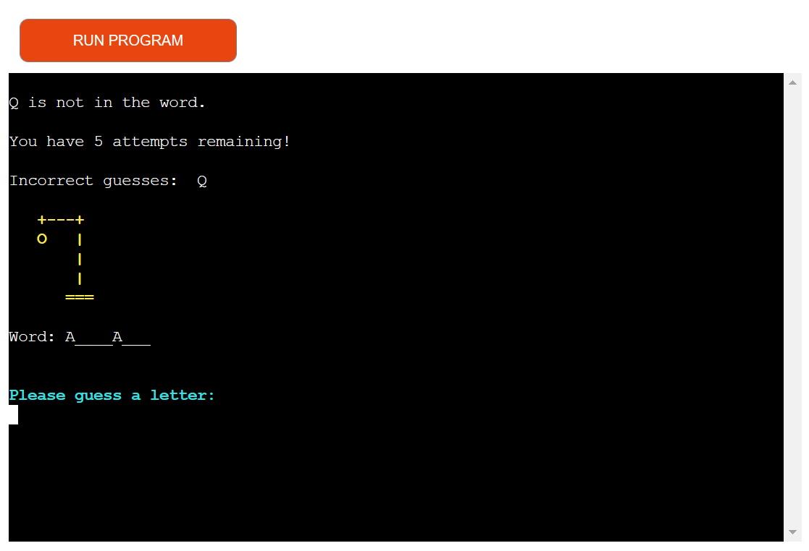

7. If the user runs out of tries, game over is displayed with the hangman image completed. The user is informed of the complete word to provide them with some resolution. 

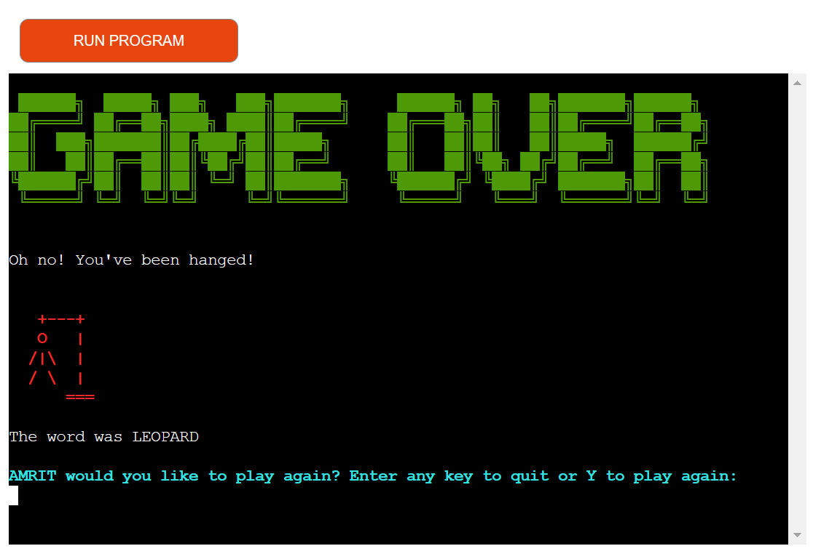

8. If the user guesses all the correct letters while they have tries remaining, they win the game. They are rewarded with a trophy and a well done message confirming what the word was. 

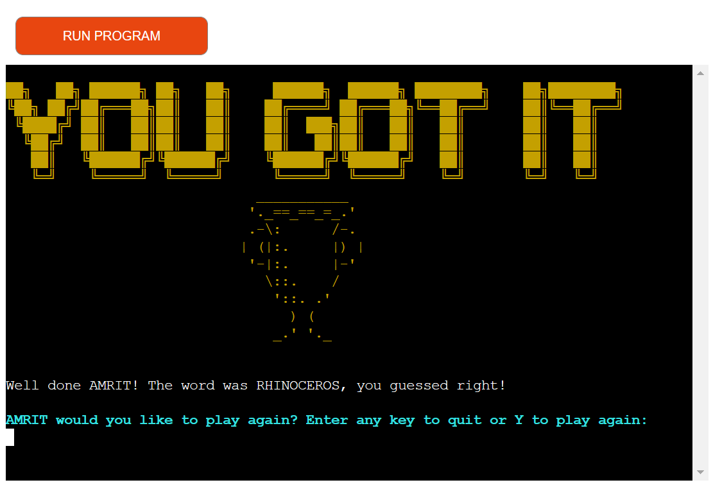

9. Whether the user wins or loses, the will computer follow up to provide instructions on how the user can proceed if they want quit or play again.

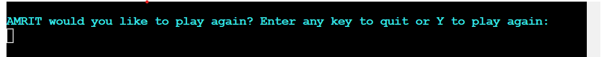

10. If the user chooses to quit, a good bye message is displayed to thank the user for playing. If the user chooses to play again, they will be returned to feature 3 with a new word to guess.

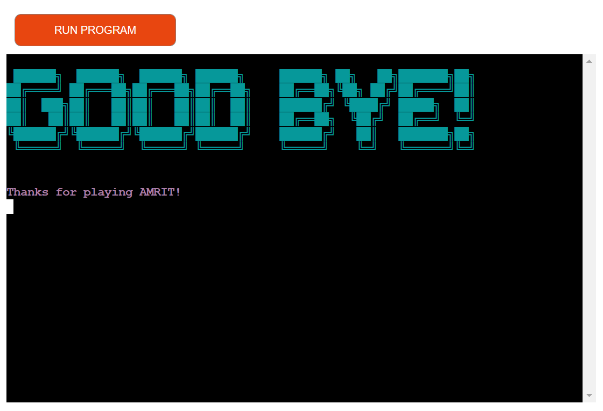

### Future features
* Add difficulty settings where the user can choose from easy or hard mode, the difference being the number of tries they get to guess the word.
* Add a leaderboard, using Google sheets to keep track of the scores and update to leaderboard.
* Add different sets words to play from i.e. animals, flowers, fruit etc

- - -

## Technologies Used

### Languages Used
Python

### Frameworks, Libraries & Programs Used
* [Am I responsive?](https://ui.dev/amiresponsive) - to show game across a range of devices.
* Git - for version control. 
* GitHub - to save and store the code pushed from Git.
* GitPod - using GitPod terminal to commit to Git and push to GitHub.
* [Lucid Chart](https://lucid.app/) - to create the flow chart.
* Termcolor module - to print colored text to the terminal.

- - -

## Testing 
Issues raised in my project meetings with my mentor [Chris Quinn](https://github.com/10xOXR) :

### Solved Bugs

### Known Bugs

### PEP8 
Testing carried out via [PEP8 Validator](https://pep8ci.herokuapp.com/):
* [run.py](docs/testing/pep8/run-python.png) - All clear, no errors found
* [hangman.py](docs/testing/pep8/hangman-python.png) - 6 messages showing for, invalid escape sequence '\ '. These do not seem to affect the functionality of the game.
* [words.py](docs/testing/pep8/words-python.png) - All clear, no errors found

### Manual Testing
* Tested website on mobile with [Chrome](docs/testing/manualtesting/chrome-mobile.jpg) & [Samsung internet](docs/testing/manualtesting/samsunginternet-mobile.jpg)
* Tested on laptop with [Microsoft Edge](docs/testing/manualtesting/microsoftedge-laptop.png) and desktop with [Firefox](docs/testing/manualtesting/firefox-desktop.png).

- - -

## Deployment 

### Local Deployment

#### How to Clone
1. Sign up or log in to GitHub
2. Go to the repository https://github.com/Sarohia94/Project-3-Hangman
3. Go to the code dropdown and select how you'd like clone and copy the link provided
4. Go to the new repo and enter in your workspace terminal, "git clone" followed by the link copied
5. Install termcolor by entering "pip3 install termcolor" (without quotes) to the terminal 
6. Enter the following command "pip3 freeze > requirements.txt" (without quotes) to the terminal to install the termcolor dependency which will be required if this is deployed to Heroku
7. Enter command "python3 run.py" (without quotes) to run the game in the terminal

#### How to Fork
1. Sign up or log in to GitHub
2. Go to the repository https://github.com/Sarohia94/Project-3-Hangman
3. Click on the fork button towards the top right of the page 

### Remote Deployment
The website was deployed to GitHub Pages as follows:
1. Log in to GitHub
2. Assuming you have cloned or forked the repository, go on the "Settings" link for this repository
3. Click on the "Pages" link on the left hand side of the page
4. Under "Source" select "Deploy from branch" from the dropdown
5. Under "Branch" select "main" from the dropdown
6. Click "Save" which will then refresh the page
7. It might take a few mins before you can refresh and view the link to the site published

### Deploy project to Heroku
1. Assuming you have cloned or forked the repository, sign up or log in to Heroku
2. Go to "new" and click "create new app", the "create new app" is also available from the dashboard
3. Enter a unique app name and choose a region
4. Click "create app"
6. Go to the Settings tab and set the Buildbacks to Python and NodeJS, in that order
7. On the same tab go to Config Vars, click "reveal config vars" and enter PORT in to "KEY" and 8000 in to "VALUE" and then click "Add"
8. Now go to the Deploy tab and click "Connect to Github" from Deployment Method.
9. Search by the repository name (which needs to match exactly) once this is found 
10. Enable automatic deploys if preffered 
11. Go to Manual deploy, the branch to deploy should be main and then click on "Deploy Branch"
12. Once deployment is complete you can click "View" to open the game in Heroku

- - -

## Credits

### Code
* The [Invent with Python](https://inventwithpython.com/invent4thed/chapter8.html) tutorial helped break down how I could go about writing the code. I used this primarily to learn how to store and print correct and incorrect guesses. The hangman array was taken from this website too.
* The [How to build HANGMAN with Python in 10 MINUTES](https://www.youtube.com/watch?v=m4nEnsavl6w) was very useful as it gave me an overview on how to create a functioning minimum viable project. The code to update guesses to the underscores as they occur in the word was taken from this tutorial (run.py file, lines 221-226)
* Joshua from tutor support advised on how to best break my code down in to smaller functions. When I was initially splitting out my code into smaller functions I was passing 3 or more arguments and the structure wasn't as clean as it could be so I was running in to issues. Joshua was able to assist in directing me how I may want to organise the code given what I had already.
* Oisin from tutor support for helping me work through the kinks in my code. It helped a lot in making me think differently on how I can investigate issues and how to make the most out of print statments to check my code. 
* [Chris Quinn](https://github.com/10xOXR), for helping me resolve and understand the error messages showing on gitpod. He also helped to advise on the issue where correct guesses were not displaying to the word. I followed his example in writing prnt statements with the line number of the code included. This really improved my ability to pin point where issues occur and what is being affected in the background. As such I was able to resolve subsequent issues on my own much faster.

### Content
* The content was written by the developer Amritpreet Sarohia.
* ASCII art was taken from [Texteditor](https://texteditor.com/gallery/)

### Acknowledgements 
Thank you to anyone taking the time to view my third project. Special thanks to the Slack community and the below individuals:
* [Chris Quinn](https://github.com/10xOXR), my mentor. Thank you for your guidance and feedback.
* To the tutors from tutor support for their help and assistance: Scott, Joshua and Oisin